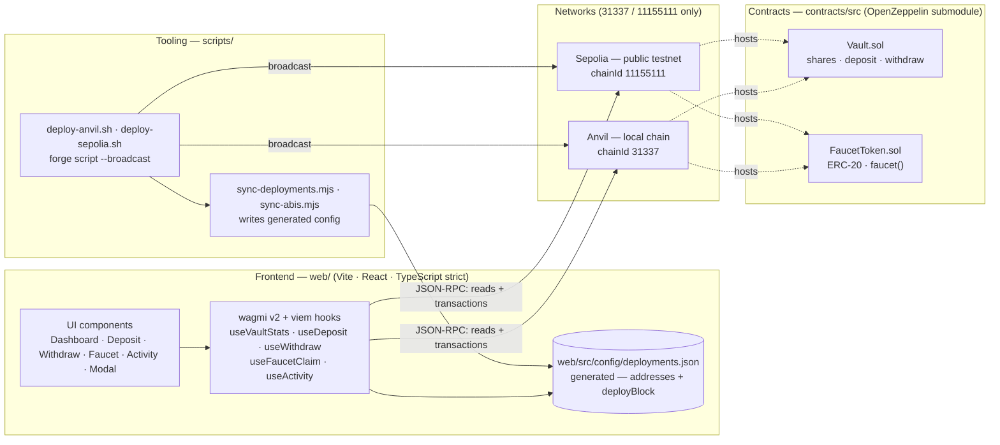
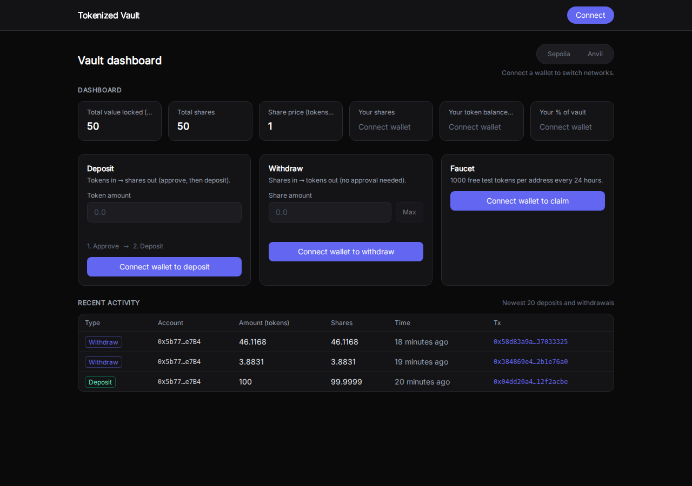
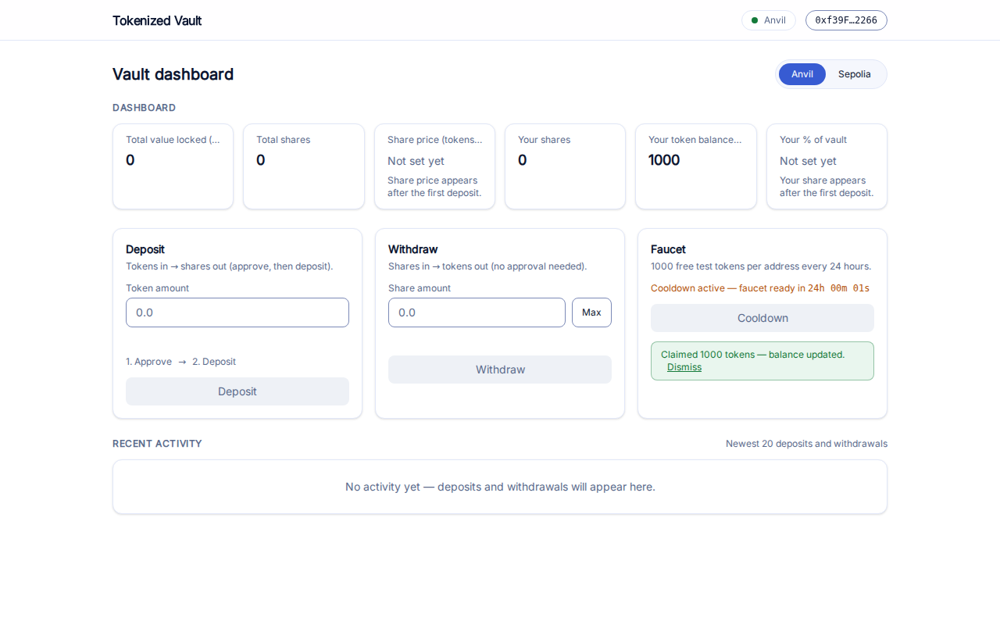
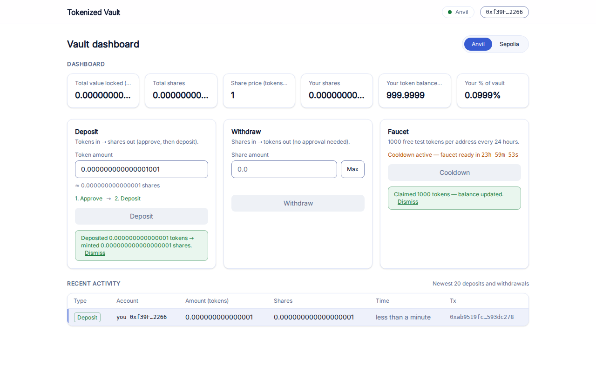
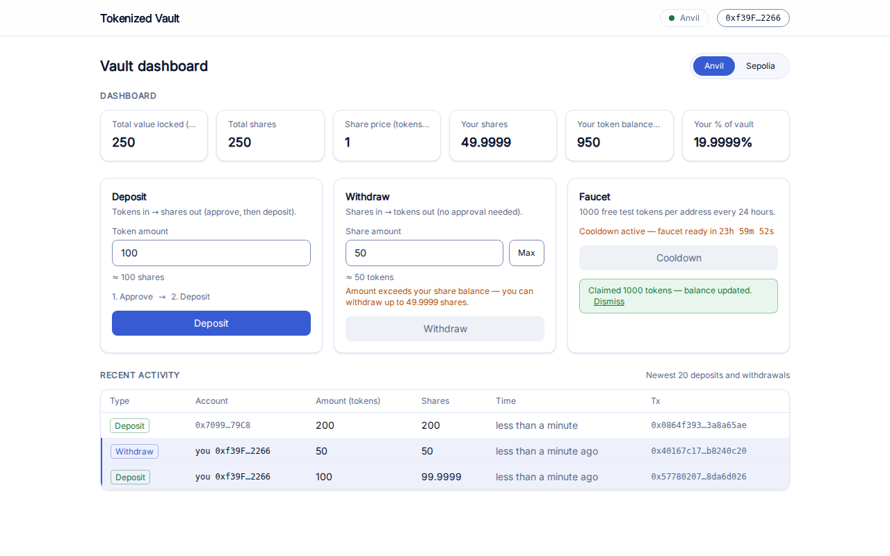
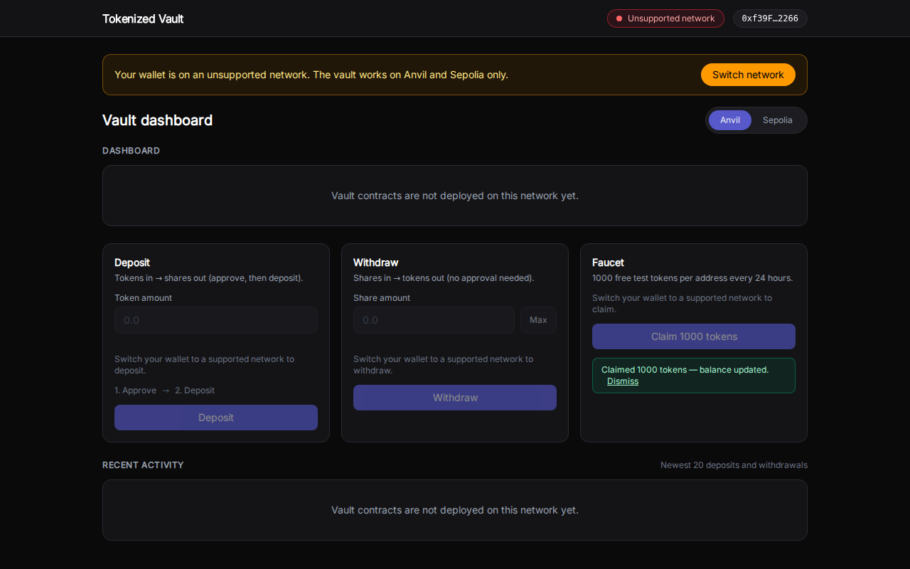
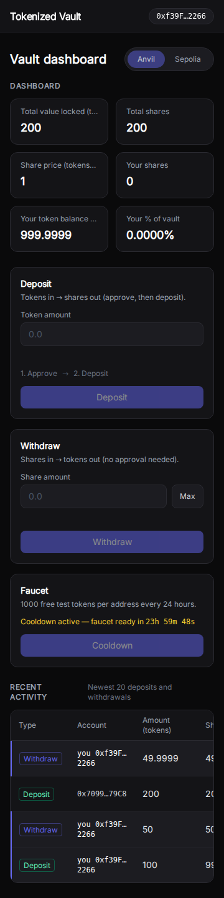

# Tokenized Vault — a tokenized vault dapp

[](https://github.com/MohammedSoliman10/tokenized-vault/actions/workflows/ci.yml)
[](LICENSE)
[](https://docs.soliditylang.org/en/latest/)
[](https://tokenized-vault.vercel.app)
[](#verification)

> **⚠️ Educational / testnet demo.** This project is an unaudited demonstration built for
> learning and testing on Anvil (31337) and Sepolia (11155111). It is **not for mainnet use
> with real funds**. No security audit has been performed; expect bugs.

**Live demo**: https://tokenized-vault.vercel.app

---

## Table of contents

- [Overview](#overview)
- [Features](#features)
- [Architecture](#architecture)
- [Design notes](#design-notes)
- [Quickstart](#quickstart)
- [Verification](#verification)
- [Screenshots](#screenshots)
- [Deployment](#deployment)
- [Contributing](#contributing)
- [Security](#security)
- [License](#license)

## Overview

A minimal ERC-4626-style tokenized vault: deposit an ERC-20 token, receive non-transferable
shares priced by `vault balance / totalSupply`, withdraw back to tokens, and claim test tokens
from a cooldown faucet. The frontend is a Vite + React + TypeScript (strict) single-page app
using wagmi v2, viem, and a custom connect modal — no RainbowKit or ConnectKit.

## Features

| # | User story | What it delivers |
|---|------------|------------------|
| US1 | Connect & dashboard | Custom wallet modal, wrong-network banner, six-stat dashboard |
| US2 | Deposit | Live share estimate, approve → deposit flow, first-deposit (dead shares) explanation |
| US3 | Withdraw | Max shares, live token estimate, inline validation |
| US4 | Faucet | 1000-token claim with a live 24 h cooldown countdown |
| US5 | Activity feed | Newest 20 Deposit/Withdraw events, live updates, explorer links only on Sepolia |

## Architecture



The frontend never hardcodes chain data: addresses, deploy blocks, and ABIs flow from
deployments via the `scripts/` tooling into `web/src/config/`, and every read is pinned to the
wallet's active chain.

## Design notes

- Shares are **non-transferable**: the vault tracks balances internally and deliberately has no
  `transfer`/`approve` surface for shares.
- **Fee-on-transfer tokens are unsupported**: deposits assume `transferFrom` moves exactly the
  amount the depositor authorized.
- 1000 **BASE UNITS** of dead shares protect against first-depositor inflation attacks: the
  first deposit mints 1000 base units (not whole tokens) to `0xdead…dead`, so a later donor
  cannot skew the share price (FR-029/FR-030).

## Quickstart

Happy path — five lines (Foundry + Node 20 installed, `anvil` running in a second terminal):

```bash
git clone --recursive https://github.com/MohammedSoliman10/tokenized-vault.git
cd tokenized-vault/web && npm install
cd ../contracts && forge test
./scripts/deploy-anvil.sh && node scripts/sync-deployments.mjs
cd web && npm run dev
```

Full scenarios (Sepolia deploys, secret hygiene, CI expectations, Definition of Done):
**[specs/001-tokenized-vault-dapp/quickstart.md](specs/001-tokenized-vault-dapp/quickstart.md)**

## Verification

Every task gates on these commands (all must exit 0):

```bash
cd contracts && forge fmt --check && forge test
cd ../web && npm run typecheck && npm run lint && npm test && npm run build
```

CI runs the same commands on every push — see [.github/workflows/ci.yml](.github/workflows/ci.yml).

## Screenshots

The first shot is the **live production site**; the rest were captured by the automated
browser walkthrough against local Anvil (chain 31337). All views are 1280×800 dark-theme
except the mobile shot (360 px viewport).

| Screenshot | What it shows |
|---|---|
|  | **Live site on Sepolia**: disconnected visitor reads TVL `50`, share price `1`, and the Deposit/Withdraw activity rows with working `sepolia.etherscan.io` tx links |
|  | US1/US4: connected header, six-stat dashboard, 1000-token claim with live cooldown countdown |
|  | US2: first deposit of 1001 base units accepted — share price exactly `1`, your share `0.0999%`, event-derived success copy, own feed row |
|  | US5: a second account deposited 200 via `cast` — TVL `250`, your share `19.9999%`, newest row arrived live, plain tx hashes (no explorer links on Anvil) |
|  | FR-003: wallet on an unsupported network — amber banner with switch CTA, every action disabled |
|  | Narrow viewport: two-column stats, stacked forms, activity table scrolls inside its own container — no page-level horizontal overflow |

## Deployment

### Live site (Vercel)

Production: **https://tokenized-vault.vercel.app** — Vercel **Root Directory**: `web`,
built via [`web/vercel.json`](web/vercel.json) (Vite framework, install/build commands,
`dist` output). The Vercel project connects to this repository with `main` as the
production branch; deployment protection is off so the demo is publicly reachable.

Environment variables (both optional — the app degrades gracefully without them):

| Variable | Purpose |
|----------|---------|
| `VITE_SEPOLIA_RPC_URL` | Custom Sepolia RPC; falls back to a public RPC when unset |
| `VITE_REOWN_PROJECT_ID` | Enables the WalletConnect option in the connect modal (injected wallets always work) |

The current production deployment sets **neither**: reads use the public RPC fallback and
the connect modal offers injected wallets only. Environment values belong in
Vercel/dashboard `.env` files only — never committed (the repo gitignores `.env*` and CI
ships no secrets).

### Sepolia contract addresses (chain 11155111)

Deployed by [`scripts/deploy-sepolia.sh`](scripts/deploy-sepolia.sh) at deploy block
`11865644`; both sources are verified on Etherscan:

| Contract | Address | Notes |
|----------|---------|-------|
| `FaucetToken` | [`0x8f6BaF9e021a57dddb2A70E7e186e6Ffb6f000f3`](https://sepolia.etherscan.io/address/0x8f6baf9e021a57dddb2a70e7e186e6ffb6f000f3) | "Vault Test Token" (`VTT`), 1000-token faucet |
| `Vault` | [`0xBF27A9d9b4f636783B1b19D94b7D1BE4e51998B0`](https://sepolia.etherscan.io/address/0xbf27a9d9b4f636783b1b19d94b7d1be4e51998b0) | `vault.token()` → the `FaucetToken` above |

`scripts/sync-deployments.mjs` mirrors both addresses and the deploy block into
[`web/src/config/deployments.json`](web/src/config/deployments.json) (chain `11155111`),
which is the single source the frontend reads.

## Contributing

See [CONTRIBUTING.md](CONTRIBUTING.md): Conventional Commits and the Definition of Done gates.
By participating you agree to the [Code of Conduct](CODE_OF_CONDUCT.md).

## Security

This code is unaudited and demo-scoped. To report a vulnerability, use GitHub's **private
vulnerability reporting** (Security tab → Report a vulnerability) as described in
[SECURITY.md](SECURITY.md) — please do not open a public issue.

## License

[MIT](LICENSE) © 2026 Mohammed Soliman
